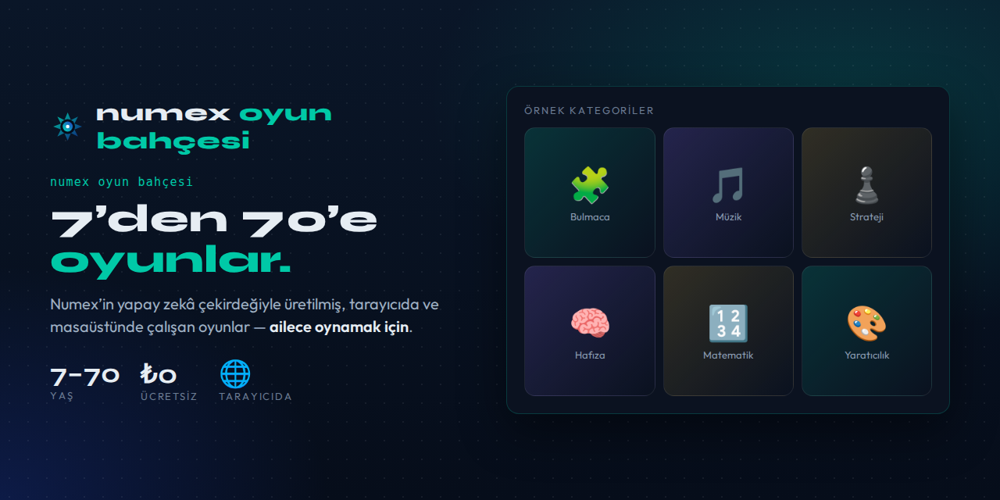

# 🎮 Numex Oyun Bahçesi

### 7'den 70'e oyunlar.

---

**Oyun Bahçesi**, [Numex Ailesi](https://www.numexai.com.tr/aile)'nin *Platform & Topluluk* kolunda
yer alan, **her yaştan** oyuncu için oyun alanıdır.

## Neden farklı?

- 🤖 **Yapay zekâyla üretildi:** Oyunlar, Numex Çekirdeği'nin kodu yazıp çalıştırıp test ettiği aynı
  otonom üretim hattından gelir — [Numex Market](https://market.numexai.com.tr)'teki *Oyunlar*
  kategorisi gibi.
- 🌐 **Kurulum yok:** Tarayıcıda açılır, oynanır.
- 👨‍👩‍👧 **Ailece:** Çocuklar için güvenli, büyükler için keyifli.
- 🧩 **Kendi oyununu yap:** [Numex Codex](https://github.com/numexai/numex-codex)'te *Oyun* proje
  türünü seç, oyununu Türkçe anlat — ajan yazsın.

## 🎧 Bir örnek: Cyber Beats

Numex'in ürettiği, **saf Web Audio API** ile çalışan 16 adımlı ritim makinesi: Kick · Snare · Hat ·
Synth, tempo ayarı, `Space` ile oynat/duraklat. Tek bir ses dosyası yok — tüm sesler tarayıcıda
sentezleniyor.
👉 [dene.numexai.com.tr/cyberbeats](https://dene.numexai.com.tr/cyberbeats/)

## 💡 Oyun önerin mi var?

*"Şöyle bir oyun olsa…"* → [Issue aç](../../issues). Beğenilen fikirler Numex'e ürettirilip Oyun
Bahçesi'ne eklenebilir.

---

**Numex Ailesi** · [Numex AI](https://numexai.com.tr) · [Codex](https://github.com/numexai/numex-codex) · [Okul](https://github.com/numexai/numex-okul) · [Market](https://market.numexai.com.tr) · [Numexpedia](https://github.com/numexai/numex-pedia) · [Hub](https://github.com/numexai/numex-hub) · [Forge](https://github.com/numexai/numex-forge) · [API](https://github.com/numexai/numex-api) · [SDK](https://github.com/numexai/numex-sdk) · [Pusulam](https://github.com/mobilcep/pusulamx) · [PC Doktoru](https://github.com/mobilcep/pcdoktoru)

*İnsanı önce koyan Türk yapay zekâsı* 🇹🇷 · [Tüm ekosistem →](https://github.com/numexai/numex_nedir)

